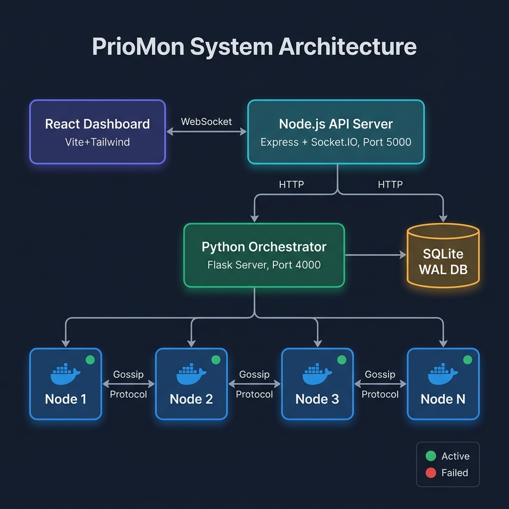

<div align="center">

# ⚡ PrioMon

### Priority-Based Distributed Monitoring System

[](https://python.org)
[](https://react.dev)
[](https://docker.com)
[](https://nodejs.org)
[](https://sqlite.org)
[](LICENSE)

A production-grade distributed monitoring system that uses a custom **Gossip Protocol** to propagate system metrics across a cluster of containerized nodes. The **Value-of-Information (VoI)** engine intelligently filters redundant data, reducing network bandwidth usage by up to **100×** while ensuring critical state changes propagate instantly.

</div>

---

## 📐 Architecture



The system is composed of four distinct layers:

| Layer | Technology | Responsibility |
|---|---|---|
| **Frontend** | React 18, Vite, Tailwind CSS | Real-time dashboard with live force-graph topology |
| **API Gateway** | Node.js, Express, Socket.IO | Bridges frontend ↔ orchestrator; live WebSocket push |
| **Orchestrator** | Python, Flask | Manages experiment lifecycle, boot sequence, kill events |
| **Node Cluster** | Python, Docker, SQLite WAL | Gossip engine, VoI filtering, metric propagation |

---

## ✨ Key Engineering Features

- **Custom Gossip Protocol** — Decentralized metric dissemination. No single point of failure. Each node periodically fans out to `k` random peers until the entire cluster converges.
- **Value-of-Information (VoI) Filtering** — A bandwidth optimization layer that evaluates whether a metric change is significant enough to transmit. Uses configurable priority tiers (HIGH/MEDIUM/LOW) and a delta threshold `δ` to suppress redundant updates.
- **Chaos Engine** — A built-in fault injection system. Any live node can be soft-killed via the dashboard, triggering the in-cluster failure detection (3-strike Leaderless Quorum Consensus) and visually severing links in the topology graph in real time.
- **RAF-batched WebSocket State** — The React frontend uses a `requestAnimationFrame` loop to batch 10–20 socket messages/sec into a single React state flush, preventing layout thrashing in the force-graph.
- **SQLite WAL Mode** — Write-Ahead Logging ensures that high-frequency concurrent simulation writes are safe for SSD hardware and provide consistent reads during active writes.
- **Fully Containerized** — Each gossip node runs as an isolated Docker container. The cluster is defined entirely in `docker-compose.yml`.

---

## 🛠️ Tech Stack

```
Backend        Python 3.9+, Flask, SQLite (WAL), Docker
API Server     Node.js, Express, Socket.IO
Frontend       React 18, Vite, Tailwind CSS, react-force-graph-2d
Orchestration  Docker Compose
```

---

## 📂 Project Structure

```
PrioMon/
│
├── src/                       # Core Gossip Engine (Python)
│   ├── app/
│   │   ├── priomon.py         # Gossip node entrypoint — handles fan-out & VoI logic
│   │   ├── node.py            # Node state machine, peer tracking, failure detection
│   │   ├── query.py           # Flask routes: /gossip, /query, /terminate
│   │   ├── utility.py         # VoI delta calculations, metric helpers
│   │   ├── singleton.py       # Process-safe node singleton
│   │   └── Dockerfile         # Container definition for a single gossip node
│   └── query_client.py        # CLI query bridge to inspect a running cluster
│
├── experiments/               # Simulation Orchestrator & Analytics
│   ├── monitoring.py          # Flask orchestrator: boots cluster, streams metrics
│   ├── plot.py                # Post-run analytics: convergence, bandwidth charts
│   ├── schema.py              # SQLite schema definitions
│   ├── connector_db.py        # Database connection & query helpers
│   └── config.ini             # Simulation parameters (nodes, gossip rate, etc.)
│
├── dashboard/                 # Full-Stack Monitoring Dashboard
│   ├── api/
│   │   ├── server.js          # Express + Socket.IO API server (port 5000)
│   │   └── package.json
│   └── client/
│       ├── src/
│       │   ├── App.jsx                        # Root orchestrator component
│       │   ├── hooks/useGossipSocket.js       # Socket.IO lifecycle + RAF-batched state
│       │   ├── hooks/useConfig.js             # Config fetch/save with INI bridge
│       │   └── components/
│       │       ├── LiveTopologyGraph.jsx      # Force-directed cluster graph
│       │       ├── NodeInspector.jsx          # Slide-in node diagnostics panel
│       │       ├── ResourceCard.jsx           # CPU/Memory/Network/Storage cards
│       │       ├── SectionCard.jsx            # Config section editor
│       │       ├── Spinner.jsx                # Loading + VoI efficiency badge
│       │       ├── Toast.jsx                  # Notification system
│       │       └── index.css                  # Global styles + animations
│       ├── index.html
│       └── package.json
│
├── docs/
│   └── architecture.png       # System architecture diagram
│
├── research_archive/          # Academic research artifacts (paper, reviews)
├── docker-compose.yml         # Cluster container definitions
└── requirements.txt           # Orchestrator Python dependencies
```

---

## 🚀 Quick Start

### Prerequisites

- **Docker** & **Docker Compose** (for the node cluster)
- **Python 3.9+** with `pip` (for the orchestrator)
- **Node.js 18+** & `npm` (for the dashboard)

### 1. Clone & Install

```bash
git clone https://github.com/parth-1372/EdgeWatch.git
cd EdgeWatch

# Install orchestrator dependencies
pip install -r requirements.txt

# Install dashboard dependencies
cd dashboard/api && npm install && cd ../..
cd dashboard/client && npm install && cd ../..
```

### 2. Start the Node Cluster

```bash
docker-compose up --build -d
```

This builds and starts all gossip nodes as isolated Docker containers.

### 3. Start the Orchestrator

```bash
python experiments/monitoring.py
```

The Python orchestrator starts on `http://localhost:4000` and waits for a start signal.

### 4. Start the Dashboard

```bash
# Terminal 1 — API server
cd dashboard/api && npm start

# Terminal 2 — React client
cd dashboard/client && npm run dev
```

Open the dashboard at **`http://localhost:5173`**.

### 5. Boot the Experiment

Click **"BOOT DISTRIBUTED NETWORK"** in the dashboard, or call:
```bash
curl -X POST http://localhost:4000/start
```

The cluster begins gossiping. Watch the live topology graph converge in real time.

---

## 📊 Analytics

After a simulation completes, generate performance charts:

```bash
python experiments/plot.py
```

Outputs PNG charts in `experiments/` covering:
- **Convergence time** vs. node count
- **Bandwidth savings** from VoI filtering
- **Message success rate** per round

---

## ⚙️ Configuration

Edit `experiments/config.ini` to change simulation parameters:

```ini
[PriomonParam]
node_range       = "[10]"     ; Number of nodes in the cluster
gossip_rate      = 3          ; Fan-out — peers contacted per round
runs             = 1          ; Number of experiment runs

[system_setting]
failure_rate     = 0.0        ; Probability of artificial message drop
docker_ip        = 127.0.0.1

[database]
db_file          = PrioMonDB.db
```

---

## 📄 License

MIT © Parth Mungra